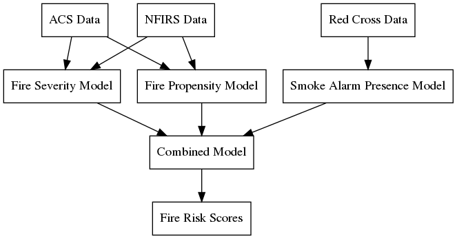

Data Pipeline
=============

This section describes this project's pipeline from raw data inputs to model
predictions. It can be a useful reference for those who want to:

- Troubleshoot project code.
- Understand the sequence of analytical steps.
- Assess the status of different modeling initiatives.

Overview
--------

At a high level, this project uses several data sources to predict the
probability and severity of fires in the US at the census block level, as well
as the prevalence of smoke detectors.

Data Sources
------------

We use the following data sources to train models and make predictions.

NFIRS Data
~~~~~~~~~~

The `National Fire Incident Reporting System`_ (NFIRS) has data on fires and
other incidents reported by fire departments across the US. This voluntary
system captures about 70% of estimated fire incidents each year (ref?).

We use eight years of data with approximately 250K cases per year, for a total
of 2M fire incidents. We assign each incident to a census block after cleaning
and geocoding the reported addresses.

.. todo::

   Document the NFIRS raw data.

   - Identify the years we use.
   - Describe the cleaning and geocoding steps.
   - Describe how the data will grow.
   - Link to relevant code in docs.

.. _National Fire Incident Reporting System: https://www.nfirs.fema.gov/

ACS Data
~~~~~~~~

The `American Community Survey`_ (ACS) has detailed demographic and housing data
for communities across the US. The ACS data include 74,134 census tracts and
211,267 census block groups.

.. todo::

   Document the ACS raw data.

   - Describe the types of variables we're interested in.
   - Describe the geographic granularity & extent.
   - Identify the years we use.
   - Describe how the data will grow.
   - Link to relevant code in docs.

.. _American Community Survey: https://www.census.gov/programs-surveys/acs

Red Cross Data
~~~~~~~~~~~~~~

Since 2014 the American Red Cross has documented their campaigns to install
free smoke alarms in homes that need them. We use these data to identify areas
that tend to need this service. These data include about 900K cases.

.. todo::

   Document the Red Cross raw data.

   - Describe how to acquire the data.
   - Identify the years we use.
   - Describe how the data will grow.
   - Link to relevant code in docs.

Models
------

Fire Severity Model
~~~~~~~~~~~~~~~~~~~

.. todo::

   Describe the fire severity model.

   - Describe the general purpose.
   - Describe the input data and any transformations.
   - Describe the outcome variable.
   - Describe the features.
   - Describe the modeling approach.
   - Link to any relevant code.

.. From slides:

  - Objective: Predict which Census Geographies will be in >90th percentile of severe fire numbers the following year
  - Severe fire = >10K damage || injury || death
  - Inputs: NFIRS (fire incidence) and ACS (demographics)
  - Model: Balanced Random forest Model
  - Python: imb-learn
  - Preliminary Results:
  - 77% Recall at the Census block level

Fire Propensity Model
~~~~~~~~~~~~~~~~~~~~~

.. todo::

  - Objective: Predict which Census Geographies will be in >90th percentile of total # of home fires the following year
  - Inputs: NFIRS (national fire incidents reporting) and ACS (census demographics)
      1. 'NFIRS Fire Incident Data.csv' (2009-2016)
        - Hundreds of thousands of records with each record representing a fire incident in a US location
      2. 'ACS 5YR Block Group Data.csv' OR 'ACS 5YR Tract Data.csv' (2013-2017)
        - Hundreds of thousands of records with each record representing the demographics of a census geoid
      * New NFIRS & ACS data is released each year
  - Data Transformation:
      - NFIRS:
          1. Aggregated individual fire incidents into tabular format (records # of fires in each year in each geoid)
          2. Normalized number of fires by total population in the respective geoid
      - ACS:
          1. Removed non-numeric variables
          2. Removed 9 variables that are highly correlated with other variables in the dataset
  - Outputs: Label predictions (0: not Top 10%, 1: Top 10%) & prediction probabilities for each census geography
      1. 'PropensityBlockModel_2014_2016.csv' - provides predictions for years 2014-2016, but can be updated each year
  - Model: Balanced Random forest Model using Python imb-learn package
      - Script: 'NFIRS_Block_level.ipynb'
      - Training Method: leverage all available data prior to target prediction year
          - Training Method Example: to predict 2016 top 10%, train on NFIRS 2009-2015 & ACS 2013-2015
          - Each record represents the feature values for a single geoid
      - Features: the below features were selected from a larger group of ~100 b/c model importance score is > 0.01:
          1. Sum of fires over selected years in the given geoid
          2. Mean number of fires over selected years in the given geoid
          3. Max number of fires over selected years in the given geoid
          4. % of houses in geoid built before 1939
          5. % of houses in geoid that are occupied
          6. % of houses in geoid whose heating source is kerosene
          7. % of houses in geoid with just a single occupant
          8. % of houses in geoid inhabited by married couple
          9. % of people in geoid with a bachelors degree
          10. % of people in geoid that have worked within the past year
          11. % of people in geoid that are black
          12. % of houses in geoid occupied by the owner
          13. % of people in geoid that have attended college but not graduated
          14. % of houses in geoid with value between $175-200K
          15. % of houses in geoid with value between $200-250K
          16. % of houses in geoid with a home equity loan
      - Preliminary Results:
        - 65-75% weighted Avg Recall at the Census block level
        - 75-85% Recall at the Census tract level

Smoke Alarm Presence Model
~~~~~~~~~~~~~~~~~~~~~~~~~~

The smoke alarm presence model quantifies the need for Red Cross smoke detector
installation efforts. When the Red Cross visits households to check and install
smoke detectors, they record the number and condition of smoke detectors in each
household prior to providing services. This model uses Red Cross visits as
convenience samples to estimate smoke detector prevalence in block groups.

See ``Code/Models/Smoke_Alarm_Model.ipynb`` for the implementation.

The model predicts the block-group level probability of finding at least one
working smoke detector in a given household. It estimates this probability from
the sample proportion of households recording at least one working smoke
detector prior to Red Cross intervention.

The input data include about 500 thousand household visits over five years.
The Red Cross anonymizes the data and geocodes each household to a census block
group before providing the data to this project; we take these steps as given.
We process the raw data in the following steps:

1. Drop households that are missing smoke detector data.
2. Classify each household (has a smoke detector or not).
3. Aggregate household statuses into block group averages.

Our goal is to make estimates that are both stable and granular. For more stable
estimates, we require block group averages to derive from at least 30
observations. If a block group does not have enough observations, then we base
the block group estimate on progressively larger geographies until it is based
on at least 30 observations. The geographic units are (in order):

1. Census block group
2. Census tract
3. County
4. State

As the Red Cross makes more visits, this model will incorporate additional
household data to refine smoke detector probability estimates.

Combined Model
~~~~~~~~~~~~~~

.. todo::

   Describe the combined model.

   - Describe the general purpose.
   - Describe the input data and any transformations.
   - Describe the outcome variable.
   - Describe the features.
   - Describe the modeling approach.
   - Link to any relevant code.

.. NOTES
  - Data pipeline graph.
    - Dependencies.
    - Variables used.
    - Status.
      - Not started.
      - Notebook (name the notebook).
      - Package (name the module).
  - Narrative for each data source.
    - High-level description.
    - Source location.
    - Dimensions.
    - Years covered.
    - Growth over time.
    - Each case is a ...
    - Geographic granularity.
    - Geographic extent.
    - Special notes.
    - Links to code.
  - Narrative for each model.
    - Model purpose.
    - Variables used.
    - Special notes.
    - Links to code.
