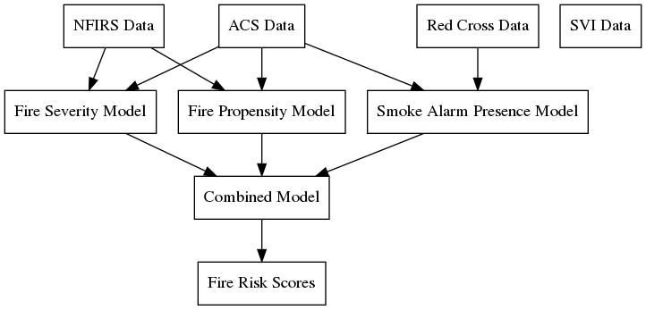

Data Pipeline
=============

This section describes this project's pipeline from raw data inputs to model
predictions. It can be a useful reference for those who want to:

- Troubleshoot project code.
- Understand the sequence of analytical steps.
- Assess the status of different modeling initiatives.

Overview
--------

At a high level, this project uses several data sources to predict the
probability and severity of fires in the US at the census block level, as well
as the prevalence of smoke detectors.

Data Sources
------------

We use the following data sources to train models and make predictions.

NFIRS Data
~~~~~~~~~~

The `National Fire Incident Reporting System`_ (NFIRS) has data on fires and
other incidents reported by fire departments across the US. This voluntary
system captures about 70% of estimated fire incidents each year (ref?).

We use eight years of data with approximately 250K cases per year, for a total
of 2M fire incidents. We assign each incident to a census block after cleaning
and geocoding the reported addresses.

.. todo::

   Document the NFIRS raw data.

   - Identify the years we use.
   - Describe the cleaning and geocoding steps.
   - Describe how the data will grow.
   - Link to relevant code in docs.

.. _National Fire Incident Reporting System: https://www.nfirs.fema.gov/

ACS Data
~~~~~~~~

The `American Community Survey`_ (ACS) has detailed demographic and housing data
for communities across the US. The ACS data include 74,134 census tracts and
211,267 census block groups.

.. todo::

   Document the ACS raw data.

   - Describe the types of variables we're interested in.
   - Describe the geographic granularity & extent.
   - Identify the years we use.
   - Describe how the data will grow.
   - Link to relevant code in docs.

.. _American Community Survey: https://www.census.gov/programs-surveys/acs

Red Cross Data
~~~~~~~~~~~~~~

Since 2014 the American Red Cross has documented their campaigns to install
free smoke alarms in homes that need them. We use these data to identify areas
that tend to need this service. These data include about 900K cases.

.. todo::

   Document the Red Cross raw data.

   - Describe how to acquire the data.
   - Identify the years we use.
   - Describe how the data will grow.
   - Link to relevant code in docs.

Models
------

Fire Severity Model
~~~~~~~~~~~~~~~~~~~

.. todo::

   Describe the fire severity model.

   - Describe the general purpose.
   - Describe the input data and any transformations.
   - Describe the outcome variable.
   - Describe the features.
   - Describe the modeling approach.
   - Link to any relevant code.

.. From slides:

  - Objective: Predict which Census Geographies will be in >90th percentile of severe fire numbers the following year
  - Severe fire = >10K damage || injury || death
  - Inputs: NFIRS (fire incidence) and ACS (demographics)
  - Model: Balanced Random forest Model
  - Python: imb-learn
  - Preliminary Results:
  - 77% Recall at the Census block level

Fire Propensity Model
~~~~~~~~~~~~~~~~~~~~~

.. todo::

   Describe the fire propensity model.

   - Describe the general purpose.
   - Describe the input data and any transformations.
   - Describe the outcome variable.
   - Describe the features.
   - Describe the modeling approach.
   - Link to any relevant code.

.. From slides:

  - Objective: Predict which Census Geographies will be in >90th percentile of total number of home fires the following year
  - Inputs: NFIRS (fire incidence) and ACS (demographics)
  - Model: Balanced Random forest Model
  - Python: imb-learn
  - Preliminary Results:
  - 75-80% weighted Avg Recall at the Census block level
  - 85-90% Recall at the Census tract level

Smoke Alarm Presence Model
~~~~~~~~~~~~~~~~~~~~~~~~~~

.. todo::

   Describe the smoke alarm presence model.

   - Describe the general purpose.
   - Describe the input data and any transformations.
   - Describe the outcome variable.
   - Describe the features.
   - Describe the modeling approach.
   - Link to any relevant code.

.. From slides:

  - Objective: Predict what percentage of households within census geographies have a working smoke detector
  - Inputs: RC Home Visits (Smoke Alarm Presence)
  - 1 million houses visited
  - Model: Hierarchical statistical model
  - smoke detector presence at time of visit
  - mean + standard error at first geography with > 30 records

Combined Model
~~~~~~~~~~~~~~

.. todo::

   Describe the combined model.

   - Describe the general purpose.
   - Describe the input data and any transformations.
   - Describe the outcome variable.
   - Describe the features.
   - Describe the modeling approach.
   - Link to any relevant code.

.. NOTES
  - Data pipeline graph.
    - Dependencies.
    - Variables used.
    - Status.
      - Not started.
      - Notebook (name the notebook).
      - Package (name the module).
  - Narrative for each data source.
    - High-level description.
    - Source location.
    - Dimensions.
    - Years covered.
    - Growth over time.
    - Each case is a ...
    - Geographic granularity.
    - Geographic extent.
    - Special notes.
    - Links to code.
  - Narrative for each model.
    - Model purpose.
    - Variables used.
    - Special notes.
    - Links to code.
